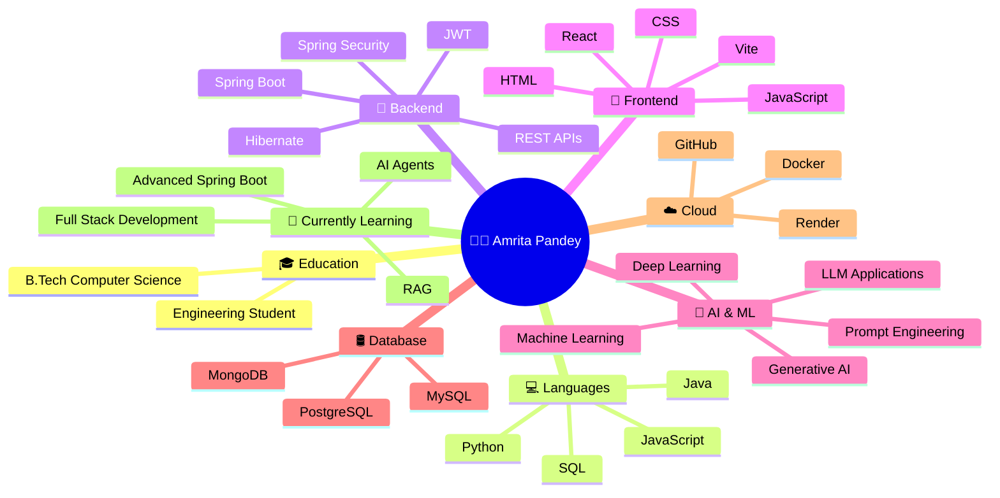
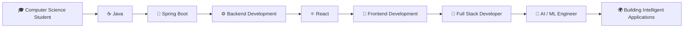
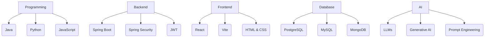
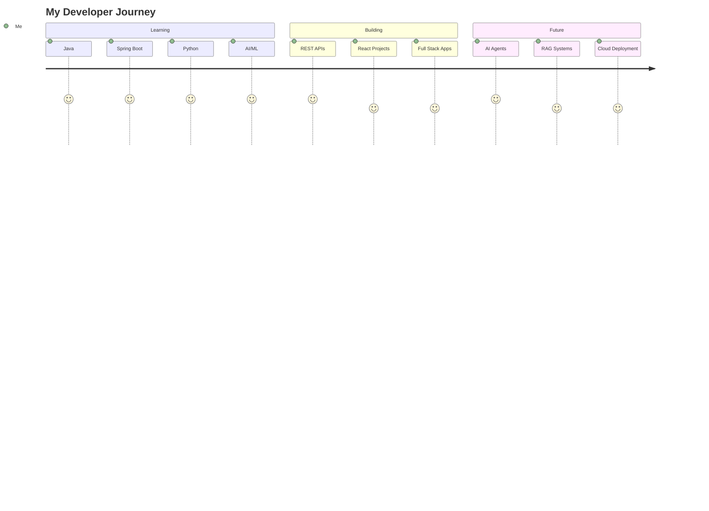
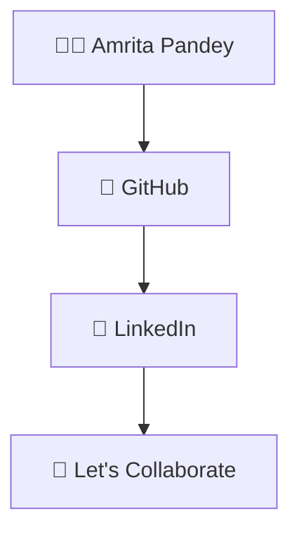
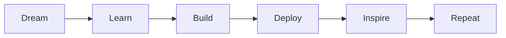

## Hi there 👋
# Hi 👋, I'm Amrita Pandey

<h3 align="center">
🚀 Computer Science Engineer | Java Developer | AI/ML Enthusiast
</h3>

---

## 👨‍💻 About Me

---

# 🚀 Developer Journey

---

# 💼 Tech Stack

---

# 🌟 What I'm Working On

---

# 🌐 Connect With Me

---

## 📫 Connect

🐙 GitHub:
https://github.com/amritapandey623

💼 LinkedIn:
https://www.linkedin.com/in/amrita-pandey-3s

📧 Email:
amritapandey3210@Gmail.com

---

# 🚀 Motto

---

⭐ Thanks for visiting my profile ⭐

Keep Learning • Keep Building • Keep Growing 🚀

<!--
**amritapandey623/amritapandey623** is a ✨ _special_ ✨ repository because its `README.md` (this file) appears on your GitHub profile.

Here are some ideas to get you started:

- 🔭 I’m currently working on ...
- 🌱 I’m currently learning ...
- 👯 I’m looking to collaborate on ...
- 🤔 I’m looking for help with ...
- 💬 Ask me about ...
- 📫 How to reach me: ...
- 😄 Pronouns: ...
- ⚡ Fun fact: ...
-->
